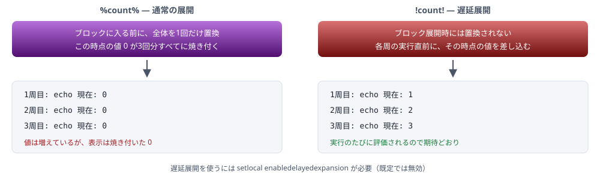

# 第2回 制御構文と展開の罠

全3回シリーズ（2/3）  |  この回のゴール: ループの中で変数が更新されない理由を説明でき、正しく書ける

> 📅 作成: 2026-08-25 / 更新: 2026-08-25

[← README に戻る](../README.md)

## 目次

1. [前回の復習と、この回の見取り図](#ch01)
2. [条件分岐 `if`](#ch02)
3. [繰り返し `for`](#ch03)
4. [遅延展開 — この回の山場](#ch04)
5. [文字列操作](#ch05)
6. [サブルーチン — 関数の代わり](#ch06)
7. [エスケープをまとめる](#ch07)
8. [デモ — ループと振り分け](#ch08)
9. [まとめと第3回の予告](#ch09)

<a id="ch01"></a>

## 1. 前回の復習と、この回の見取り図

### 前回の結論

cmd.exe は**1行を読み、変数を文字列に置換し、コマンドを実行する**。これを繰り返します。置換は実行の前に済んでいて、置換後の行はもう一度コマンドとして読み直されます。

この回で扱う `if` と `for` は、どちらも `(` 〜 `)` でブロックを作ります。そして**ブロックは1つの論理行として扱われる**ため、置換もブロック全体に対して一度に行われます。この回の罠はすべてここから来ます。

### この回で答える問い

次のコードは、`.txt` ファイルが3つあるフォルダで実行すると何を表示するか。

```
@echo off
setlocal
set count=0
for %%f in (*.txt) do (
    set /a count=count+1
    echo 現在: %count%
)
echo 合計: %count%
```

```
現在: 0
現在: 0
現在: 0
合計: 3
```

ループの中では 0 のまま、ループを抜けると 3 になる。この一見矛盾した挙動を説明できるようになるのが、この回の前半の目標です。

### この回で扱うもの

| 章 | 内容 | 他の言語との対応 |
| --- | --- | --- |
| 2 | `if` | `if` / `else`。ただし `else if` の連鎖は書きにくい |
| 3 | `for` | `for...of` / `for (i=0;…)` / ファイル読み込み |
| 4 | 遅延展開 | 対応するものがない。バッチ固有 |
| 5 | 文字列操作 | `substring` / `replace` |
| 6 | サブルーチン | 関数。ただし引数と戻り値の扱いが大きく違う |
| 7 | エスケープ | — |

<a id="ch02"></a>

## 2. 条件分岐 `if`

### 4種類の `if`

バッチの `if` は「条件式を評価する」のではなく、**4つの決まった形**のどれかです。

| 形 | 書き方 | 意味 |
| --- | --- | --- |
| 文字列比較 | `if "%A%"=="x"` | 文字列が等しいか |
| 存在確認 | `if exist "path"` | ファイル・フォルダがあるか |
| 変数の定義 | `if defined A` | 変数が定義されているか（`%` で囲まない） |
| 終了コード | `if errorlevel 1` | 終了コードが指定値**以上**か |

これに `not`（否定）と `/i`（大文字小文字を区別しない）を組み合わせます。

### 両辺を `"` で囲む理由

```
rem 変数が空のとき、この行は  if ==x  という壊れた行になる
if %A%==x echo 一致

rem 引用符で囲めば  if ""=="x"  になり、正しく「不一致」と判定される
if "%A%"=="x" echo 一致
```

前回のとおり、未定義や空の変数は置換されて**その場所から消えます**。引用符は、消えても構文が壊れないようにするための足場です。`if "%A%"=="x"` という書き方が定型になっているのはこのためです。

### 数値の比較

`==` は文字列比較なので、`"05"` と `"5"` は不一致になります。数値として比べるには専用の演算子を使います。

| 演算子 | 意味 | 他の言語 |
| --- | --- | --- |
| `EQU` | 等しい | `==` |
| `NEQ` | 等しくない | `!=` |
| `LSS` / `LEQ` | より小さい / 以下 | `<` / `<=` |
| `GTR` / `GEQ` | より大きい / 以上 | `>` / `>=` |

```
if %COUNT% GEQ 10 echo 10件以上あります
```

この形では引用符で囲みません（囲むと文字列比較になります）。そのため `%COUNT%` が空だと構文エラーになります。空の可能性があるなら、先に `if not defined COUNT set "COUNT=0"` のように既定値を入れておきます。

### `else` の書き方には制約がある

```
rem 正しい: ) と else と ( が同じ行にある
if "%MODE%"=="test" (
    echo テストモード
) else (
    echo 本番モード
)
```

**[構文エラー]** `)` と `else` を別の行に分けると動きません。`if` 文全体が1つの論理行として解析されるためです。

```
rem これは動かない
if "%MODE%"=="test" (
    echo テストモード
)
else (
    echo 本番モード
)
```

### `else if` の連鎖は書きにくい

入れ子にすると急速に読みにくくなります。

```
rem 入れ子（読みにくい）
if "%EXT%"==".txt" (
    echo テキスト
) else if "%EXT%"==".log" (
    echo ログ
) else (
    echo その他
)
```

分岐が3つ以上になるなら、`goto` でラベルに飛ばすほうが読めます。他の言語では避けられる書き方ですが、バッチではこちらが素直です。

```
if "%EXT%"==".txt" goto :is_txt
if "%EXT%"==".log" goto :is_log
goto :is_other

:is_txt
echo テキスト
goto :done

:is_log
echo ログ
goto :done

:is_other
echo その他

:done
```

<a id="ch03"></a>

## 3. 繰り返し `for`

### 4つの形を使い分ける

バッチの `for` は、オプションによって「何を回すか」が変わります。同じキーワードですが、別のコマンドだと考えたほうが理解しやすいです。

| 形 | 回すもの | 例 |
| --- | --- | --- |
| 無印 | ファイル名 / 空白区切りの文字列 | `for %%f in (*.txt) do …` |
| `/l` | 数値の範囲（開始,増分,終了） | `for /l %%i in (1,1,5) do …` |
| `/f` | ファイルの各行 / 文字列 / コマンド出力 | `for /f "delims=" %%l in (a.txt) do …` |
| `/r` | サブフォルダも含むファイル | `for /r "C:\work" %%f in (*.log) do …` |
| `/d` | フォルダのみ | `for /d %%d in (*) do …` |

### ループ変数は `%%`

バッチファイル内では `%%f`、コマンドプロンプトに直接打つときは `%f` です。前回の `%%` エスケープと同じ理由です。

変数名は1文字で、大文字と小文字は別物として扱われます。`%%f` と `%%F` は違う変数です。

### 無印の `for` — ファイルと単語

```
rem カレントの .txt を1つずつ
for %%f in (*.txt) do echo %%f

rem 空白区切りの単語を1つずつ（配列の代用）
for %%w in (alpha beta gamma) do echo [%%w]
```

後者が、バッチで配列に一番近い書き方です。`for %%w in (%LIST%) do` のように変数を渡せば、擬似的なリスト処理になります。

### `/f` — 行を読む

実務で最もよく使い、最もつまずくのがこの形です。**括弧の中の書き方で対象の意味が変わります**。

| 書き方 | 対象 |
| --- | --- |
| `in (data.txt)` | ファイル `data.txt` の各行 |
| `in ("data.txt")` | `data.txt` という**文字列そのもの**（1回だけ回る） |
| `in ('dir /b')` | コマンドの実行結果の各行 |

ファイルを読みたいのに引用符を付けてしまい、ファイル名が1行として処理されるのがよくある誤りです。ではパスに空白が含まれる場合はどうするか。`usebackq` を付けて意味を切り替えます。

```
rem usebackq を付けると "…" がファイル名の意味になる
for /f "usebackq delims=" %%l in ("%~dp0data file.txt") do echo %%l

rem usebackq のとき、コマンド実行はバッククォートで書く
for /f "usebackq delims=" %%l in (`dir /b *.txt`) do echo %%l
```

|  | ファイル | コマンド | 文字列 |
| --- | --- | --- | --- |
| `usebackq` なし | 囲まない | `'…'` | `"…"` |
| `usebackq` あり | `"…"` | `'…'` | `'…'` |

#### `delims` と `tokens`

```
rem CSV の1列目と2列目を取り出す
for /f "tokens=1,2 delims=," %%a in (list.csv) do (
    echo 名前=%%a 年齢=%%b
)

rem ヘッダ行を飛ばす
for /f "skip=1 tokens=1,* delims=," %%a in (list.csv) do (
    echo 1列目=%%a 残り=%%b
)

rem 行全体を1つとして扱う（区切らない）
for /f "delims=" %%l in (data.txt) do echo %%l
```

`tokens` に複数を指定すると、変数はアルファベット順に自動で増えます。`%%a` を指定して `tokens=1,2,3` なら、2列目は `%%b`、3列目は `%%c` です。宣言は不要です。

> [!NOTE]
> **`/f` は空行を飛ばします。**また既定では `;` で始まる行も無視されます（`eol=;` が既定値）。行番号を数えながら処理したい場合や、設定ファイルにコメント行がある場合は、この2つの挙動を意識してください。`eol=` と書けば無視をやめられます。

### `/l` — 回数ループ

```
rem 1 から 5 まで
for /l %%i in (1,1,5) do echo %%i

rem 10 から 1 まで逆順（増分に負の値）
for /l %%i in (10,-1,1) do echo %%i
```

### ループから抜ける

`break` はありません。`goto` でループの外へ飛びます。

```
for %%f in (*.txt) do (
    if "%%~nf"=="target" goto :found
)
echo 見つかりませんでした
goto :eof

:found
echo 見つかりました
```

`continue` もありません。`if` で処理全体を囲んで「条件を満たすときだけ実行する」形にします。

```
for %%f in (*) do (
    rem .txt 以外は何もしない（continue の代用）
    if "%%~xf"==".txt" (
        echo 処理: %%f
    )
)
```

### `%%f` にも `%~` 修飾子が使える

```
for %%f in (*.txt) do (
    echo フルパス   : %%~ff
    echo 名前       : %%~nf
    echo 拡張子     : %%~xf
    echo サイズ     : %%~zf
    echo フォルダ   : %%~dpf
)
```

修飾子はループ変数名の**前**に入ります。`%%~nf` は「`f` に `~n` を適用」という並びです。

<a id="ch04"></a>

## 4. 遅延展開 — この回の山場

### なぜ 0 のままなのか

冒頭のコードに戻ります。

```
set count=0
for %%f in (*.txt) do (
    set /a count=count+1
    echo 現在: %count%
)
```

`for` の `(` 〜 `)` は**1つの論理行**です。cmd.exe はこのブロック全体を1行として読み込み、ループを始める前に**一度だけ**置換します。この時点で `count` は `0` なので、ブロックの中身は次の形に確定します。

```
rem 置換後（cmd.exe が実際に繰り返し実行するもの）
set /a count=count+1
echo 現在: 0
```

3回繰り返されるのはこの確定済みの内容です。`set /a` は毎回実行されるので値そのものは増えていますが、`echo` の行はすでに `0` という文字列になっています。ループを抜けた後の `echo 合計: %count%` は括弧の外にある別の行なので、その行が読まれた時点の値、つまり `3` が入ります。



### 使い方

```
@echo off
setlocal enabledelayedexpansion
set count=0
for %%f in (*.txt) do (
    set /a count=count+1
    echo 現在: !count!
)
echo 合計: !count!
```

`setlocal enabledelayedexpansion` を宣言し、**括弧の中では `!VAR!` で読む**。これだけです。

> [!NOTE]
> **括弧の中は常に `!VAR!` と決めてしまうのが安全です。**`%VAR%` でも正しく動くのは「ループ中に値が変わらない変数」だけです。その判断を毎回するより、機械的に統一したほうが事故が減ります。

### 遅延展開のもう1つの役割 — 再解析を止める

遅延展開は「ループで値が更新されない問題の対策」として説明されがちですが、より本質的な役割があります。**展開した結果が、もう一度コマンドとして読み直されるのを防ぐ**ことです。

```
@echo off
setlocal enabledelayedexpansion
set "MSG=Hello & World"
echo A: %MSG%
echo B: !MSG!
```

```
A: Hello
'World' は、内部コマンドまたは外部コマンド、
操作可能なプログラムまたはバッチ ファイルとして認識されていません。
B: Hello & World
```

`A` は置換されて `echo Hello & World` という**行**になり、その行が読み直されて `&` がコマンド区切りとして働きます。`B` は実行直前に値を差し込むだけで読み直さないため、記号がそのまま文字として扱われます。

ファイル名やユーザー入力のように「何が入っているか分からない値」を扱うときは、ループの外でも `!VAR!` で読むほうが安全です。

### `if` の中の `%errorlevel%` も同じ問題

```
rem 動かない: ブロック進入時の値に固定される
if exist "%SRC%" (
    copy "%SRC%" "%DST%" >nul
    if "%errorlevel%"=="0" (echo 成功) else (echo 失敗)
)
```

対処は3通りあります。

```
rem (1) 遅延展開で読む
if "!errorlevel!"=="0" (echo 成功) else (echo 失敗)

rem (2) if errorlevel を使う（この構文は実行時に評価される）
if errorlevel 1 (echo 失敗) else (echo 成功)

rem (3) || でつなぐ（最も簡潔）
copy "%SRC%" "%DST%" >nul || (echo 失敗 & exit /b 1)
```

### 遅延展開の副作用 — `!` が使えなくなる

遅延展開を有効にすると、`!` が特別な文字になります。値やメッセージに `!` を含めたい場合はエスケープが必要です。

```
@echo off
setlocal enabledelayedexpansion
set "MSG=VALUE"
echo 1: ^!MSG^!
echo 2: ^^!MSG^^!
```

```
1: VALUE
2: !MSG!
```

`^` が**2つ**必要です。1行は「`%` の展開 → `^` の処理 → `!` の展開」の順に解釈されるため、`^!` と書くと `^` が先に消費されて `!` だけが残り、そのあと展開されてしまいます。

`!` をそのまま出したい箇所が多いなら、その部分を `setlocal disabledelayedexpansion` で囲んで一時的に切るほうが読みやすくなります。

<a id="ch05"></a>

## 5. 文字列操作

バッチの文字列操作は変数の展開記法に埋め込まれています。`%VAR%` 形式の**変数にしか使えず**、引数 `%1` や `for` の `%%f` には直接使えません。いったん `set "V=%~1"` で変数に入れてから使います。

### 部分取得と置換

| 書き方 | 意味 | 例（`V=abcdefg`） | 他の言語 |
| --- | --- | --- | --- |
| `%V:~0,3%` | 0文字目から3文字 | `abc` | `slice(0,3)` |
| `%V:~3%` | 3文字目から末尾まで | `defg` | `slice(3)` |
| `%V:~-2%` | 末尾から2文字 | `fg` | `slice(-2)` |
| `%V:~0,-2%` | 末尾2文字を除いた残り | `abcde` | `slice(0,-2)` |
| `%V:abc=X%` | 置換（すべての出現箇所） | `Xdefg` | `replaceAll` |
| `%V:abc=%` | 削除（空文字に置換） | `defg` | `replaceAll(…,"")` |

### よく使う組み合わせ

| やりたいこと | 書き方 | 考え方 |
| --- | --- | --- |
| 文字列を含むか判定 | `if not "%V:abc=%"=="%V%" ( 含む )` | 削除して変化があれば含んでいた |
| 末尾の `\` を取り除く | `if "%V:~-1%"=="\" set "V=%V:~0,-1%"` | 最後の1文字を見て判定 |
| パスの区切りを置換 | `set "V=%V:\=/%"` | — |
| 文字数を数える | 直接はできない | `for /l` で1文字ずつ調べるしかない |
| 大文字小文字を無視した置換 | できない | 外部コマンド（`findstr /i` 等）を使う |

### 日付を組み立てる（第1回の続き）

第1回では `%DATE:/=%` で `20260825` を作りました。これは「`/` をすべて削除する」という置換です。

```
set "TODAY=%DATE:/=%"
```

部分取得を使えば年月日を個別に取り出せます。

```
rem %DATE% が 2026/08/25 の場合
set "YYYY=%DATE:~0,4%"
set "MM=%DATE:~5,2%"
set "DD=%DATE:~8,2%"
echo %YYYY%年%MM%月%DD%日
```

**[要注意]** どちらの方法も**地域設定に依存します**。区切りや桁位置が違う環境では正しく動きません。環境に依存しない方法は第3回で扱います。

> [!NOTE]
> **ループの中では `!V:~0,3!` のように書きます。**部分取得や置換も遅延展開の形で使えます。ただし値そのものに `=` や `:` が含まれると解釈が崩れるため、この記法で扱うのはパスや識別子程度にとどめるのが安全です。

<a id="ch06"></a>

## 6. サブルーチン — 関数の代わり

### ラベルと `call`

バッチには関数がありません。代わりに**ラベルへ飛んで戻ってくる**という形を取ります。

```
@echo off
setlocal

call :log "処理を開始します"
call :log "処理が完了しました"
goto :eof

:log
echo [%DATE% %TIME%] %~1
goto :eof
```

| 要素 | 役割 | 他の言語 |
| --- | --- | --- |
| `:log` | サブルーチンの入口 | 関数定義 |
| `call :log "…"` | 呼び出し。引数は空白区切りで渡す | 関数呼び出し |
| `%~1` | サブルーチン内での第1引数 | 仮引数 |
| `goto :eof` | 呼び出し元へ戻る | `return` |

### 忘れると事故になる2点

#### 1. メイン処理の最後に `goto :eof`

これを書かないと、処理がそのまま `:log` ラベルへ流れ込みます。ラベルは処理の区切りではなく、ただの目印だからです。

```
rem 悪い例: 最後の goto :eof がない
call :log "開始"
echo 本処理

:log
echo [%DATE% %TIME%] %~1
goto :eof
```

この場合 `echo 本処理` のあと `:log` に到達し、引数なしでログ行が1回余分に実行されます。

#### 2. `call` を付ける

`call` なしで `goto :log` すると、戻ってきません。別のバッチファイルを呼ぶときも同じです。

```
rem 戻ってこない
sub.cmd
echo この行は実行されない

rem 正しい
call sub.cmd
echo この行は実行される
```

### 戻り値をどう返すか

戻り値の仕組みはありません。2つの方法があります。

#### 方法1: 終了コードで返す

```
call :is_text "%FILE%"
if errorlevel 1 (
    echo テキストファイルではありません
) else (
    echo テキストファイルです
)
goto :eof

:is_text
if /i "%~x1"==".txt" exit /b 0
exit /b 1
```

真偽値を返すならこれが素直です。**0 が成功（真）**という向きに注意してください。他の言語の `return true` とは逆の感覚になります。

#### 方法2: 変数に書き込んで返す

```
call :get_ext "%FILE%"
echo 拡張子は !RESULT! です
goto :eof

:get_ext
set "RESULT=%~x1"
goto :eof
```

バッチにはスコープがないので、サブルーチン内で `set` した変数は呼び出し元からも見えます。関数の副作用として値を返す形です。名前の衝突を避けるため、`RESULT` のような専用の変数名を決めておきます。

> [!NOTE]
> **`call` の中だけで変数を閉じたい場合は `setlocal` を入れ子にできます。**サブルーチンの先頭に `setlocal`、末尾の `goto :eof` の前に `endlocal` を置きます。ただしこうすると方法2で値を返せなくなるため、`endlocal & set "RESULT=%RESULT%"` という定型が必要になります。ここまで来ると読みにくくなるので、規模が大きいならバッチ以外を検討する合図です。

<a id="ch07"></a>

## 7. エスケープをまとめる

ここまでに `%%`、`^&`、`^^!` が登場しました。都度覚えるのは無理なので、1つの表にまとめます。

| 文字 | そのまま書くと | エスケープ | 備考 |
| --- | --- | --- | --- |
| `%` | 変数展開として解釈される | `%%` | バッチファイル内のみ。プロンプトでは `%` 1つ |
| `^` | 次の1文字のエスケープ記号 | `^^` | 行末に置くと行継続になる |
| `&` | コマンドの区切り | `^&` | `"` の内側なら不要 |
| `\|` | パイプ | `^\|` | 同上 |
| `>` `<` | リダイレクト | `^>` `^<` | 同上 |
| `(` `)` | ブロックの区切り | `^(` `^)` | ブロック内では特に必要になる |
| `!` | 遅延展開が有効なとき変数として解釈される | `^^!` | `^` が**2つ**必要。遅延展開が無効なら不要 |
| `"` | 文字列の区切り | — | エスケープできない。数を偶数に保つ |

### 解釈される順番を覚えておく

エスケープの必要性は、1行が解釈される順番から導けます。

| 順 | 処理 | 関係する記法 |
| ---: | --- | --- |
| 1 | `%` の展開 | `%VAR%` `%1` `%%` |
| 2 | `^` の処理 | `^&` `^^` |
| 3 | `!` の展開 | `!VAR!` |
| 4 | コマンドとして解析・実行 | `&` `\|` `>` による分割 |

`!` のエスケープに `^` が2つ必要なのは、2番目の `^` 処理が3番目の `!` 展開より前にあるからです。`^!` だと `^` が2番目で消費され、3番目で `!` が展開されてしまいます。

また `%VAR%` の展開が1番目、コマンドの解析が4番目という順序が、前回から繰り返している「置換結果が読み直される」という現象そのものです。

### 迷ったときの指針

- **文字列は `"` で囲む。**`&` `|` `>` `<` `(` `)` は引用符の内側では特別扱いされません
- **記号を含む値は `!VAR!` で読む。**読み直しが起きません
- **`@echo off` を外して確認する。**展開後の行がそのまま表示されるので、どこで壊れたか一目で分かります

### 行継続

```
rem 行末の ^ で次の行に続ける
robocopy "C:\src" "C:\dst" ^
    /E /R:1 /W:1 ^
    /LOG:"%~dp0robocopy.log"
```

**[要注意]** `^` の後ろに空白があると機能しません。行末は `^` で終わらせます。

<a id="ch08"></a>

## 8. デモ — ループと振り分け

第1回で作ったバックアップスクリプトを発展させます。**フォルダ内のファイルを拡張子ごとに振り分けてコピーし、件数を報告する**ものにします。

### Step 1: フォルダ内のファイルを数える

```
@echo off
setlocal enabledelayedexpansion

set "SRCDIR=%~1"
if "%SRCDIR%"=="" set "SRCDIR=%~dp0."

set "TOTAL=0"
for %%f in ("%SRCDIR%\*") do (
    set /a TOTAL+=1
    echo !TOTAL!: %%~nxf
)
echo 合計 !TOTAL! 件
```

`!TOTAL!` で書いているのがこの回の要点です。`%TOTAL%` にすると全行が `0:` になります。

### Step 2: 拡張子で振り分ける

```
@echo off
setlocal enabledelayedexpansion

set "SRCDIR=%~1"
if "%SRCDIR%"=="" set "SRCDIR=%~dp0."

set "N_TXT=0"
set "N_LOG=0"
set "N_OTHER=0"

for %%f in ("%SRCDIR%\*") do (
    rem 拡張子で分岐する。/i で大文字小文字を区別しない
    if /i "%%~xf"==".txt" (
        set /a N_TXT+=1
    ) else if /i "%%~xf"==".log" (
        set /a N_LOG+=1
    ) else (
        set /a N_OTHER+=1
    )
)

echo .txt   : !N_TXT! 件
echo .log   : !N_LOG! 件
echo その他 : !N_OTHER! 件
```

擬似的な連想配列がないため、拡張子ごとに変数を用意しています。種類が増えるとこの形は破綻します。**「変数名を並べ始めたらバッチの限界が近い」**というのが1つの目安です。

### Step 3: 振り分けてコピーする

```
@echo off
setlocal enabledelayedexpansion

rem --- 引数チェック ---
set "SRCDIR=%~1"
if "%SRCDIR%"=="" (
    echo 使い方: %~nx0 ^<対象フォルダ^>
    exit /b 1
)
if not exist "%SRCDIR%\" (
    echo [エラー] フォルダが見つかりません: %SRCDIR%
    exit /b 1
)

rem --- 保存先はこのバッチと同じ場所 ---
set "DSTBASE=%~dp0sorted"
set "TOTAL=0"
set "FAILED=0"

for %%f in ("%SRCDIR%\*") do (
    rem 拡張子から保存先フォルダ名を作る（.txt -> txt）
    rem 空のまま置換記法を使うと予期しない値になるため、先に空を判定する
    set "EXT=%%~xf"
    if "!EXT!"=="" (
        set "EXT=noext"
    ) else (
        set "EXT=!EXT:.=!"
    )

    set "DSTDIR=%DSTBASE%\!EXT!"
    if not exist "!DSTDIR!\" md "!DSTDIR!"

    copy "%%~ff" "!DSTDIR!\" >nul && (
        set /a TOTAL+=1
        echo   OK   %%~nxf -^> !EXT!\
    ) || (
        set /a FAILED+=1
        echo   NG   %%~nxf
    )
)

echo.
echo コピー成功: !TOTAL! 件 / 失敗: !FAILED! 件
if !FAILED! GTR 0 exit /b 1
exit /b 0
```

#### このコードで使っている技法

| 箇所 | 技法 | 説明した章 |
| --- | --- | --- |
| `%%~xf` `%%~ff` `%%~nxf` | ループ変数への `%~` 修飾子 | 3章 |
| `set "EXT=!EXT:.=!"` | 遅延展開しながらの文字列置換 | 4章・5章 |
| `if /i` | 大文字小文字を無視した比較 | 2章 |
| `&&` と `\|\|` の併用 | 成功・失敗で処理を分ける | 第1回4章 |
| `-^>` | `>` のエスケープ（矢印を表示したい） | 7章 |
| `if !FAILED! GTR 0` | 遅延展開した値の数値比較 | 2章・4章 |

> [!NOTE]
> **空の変数に置換記法を使ってはいけません。**拡張子のないファイル（`LICENSE` など）では `%%~xf` が空になります。空の変数は**削除された状態**なので、そこへ `!EXT:.=!` を適用すると `.=` のような文字列が残り、`sorted\.=\` という壊れたフォルダができます。空の判定を置換より**前**に置くのが正しい順序です。

サンプルは `samples\02\` にあります。落とし穴は「失敗版」と「修正版」を対にしてあります。

| ファイル | 内容 |
| --- | --- |
| `01-delayed-ng.cmd` | **[失敗版]** `%VAR%` でループを回して 0 のままになる例 |
| `01-delayed-ok.cmd` | **[修正版]** `!VAR!` にした版。両方を実行して見比べる |
| `02-if.cmd` | `if` の4つの形と数値比較の確認 |
| `03-for.cmd` | `for` の4つの形。`/f` の `usebackq` の違いも確認できる |
| `04-string.cmd` | 部分取得・置換・含有判定 |
| `05-subroutine.cmd` | サブルーチンと戻り値の2つの方法 |
| `06-sort.cmd` | 上の Step 3（完成版） |

<a id="ch09"></a>

## 9. まとめと第3回の予告

### この回の要点

| # | 覚えること | 理由 |
| ---: | --- | --- |
| 1 | 括弧ブロックは1つの論理行。入る前に一括で展開される | ループ内で値が更新されない現象の唯一の原因 |
| 2 | 括弧の中では `!VAR!` で読む | 実行直前に評価される。判断を毎回するより機械的に統一する |
| 3 | `!VAR!` は展開結果を読み直さない | 記号を含む値も安全に扱える。遅延展開の本質的な役割 |
| 4 | `if` は両辺を `"` で囲む。数値比較は `GEQ` 等 | 空の変数で構文が壊れるのを防ぐ |
| 5 | `)` `else` `(` は同じ行に置く | 1つの論理行として解析されるため |
| 6 | `for /f` は引用符で対象の意味が変わる | 空白を含むパスは `usebackq` が必要 |
| 7 | サブルーチンは `call :label` と `goto :eof` の対 | メイン処理の末尾の `goto :eof` を忘れると流れ込む |
| 8 | 解釈順は `%` → `^` → `!` → コマンド | エスケープの必要性をこの順序から導ける |

### 第3回で扱うこと

次回は「動く」から「他人に渡せる」へ進みます。ここまでのコードには、実は配布に耐えない問題がいくつも残っています。

| 残っている問題 | 第3回で扱う内容 |
| --- | --- |
| 日付の取得が地域設定に依存している | 環境に依存しない日時の取得 |
| 日本語メッセージが化ける環境がある | 文字コードとコードページ |
| 実行した記録が残らない | ログ出力の定型 |
| ダブルクリックと別フォルダからの実行で挙動が違う | 実行環境の固定 |
| 失敗の検知が場所ごとにばらばら | エラー処理の型とテンプレート |

### この回に関連する落とし穴

詳しくは[落とし穴カタログ](A3-pitfalls.md)を参照してください。

| # | 症状 |
| ---: | --- |
| [1](A3-pitfalls.md#p1) | ループ内で変数が更新されない |
| [7](A3-pitfalls.md#p7) | `if` の中の `%errorlevel%` が期待と違う |
| [9](A3-pitfalls.md#p9) | `::` コメントを入れたらループが構文エラーになった |
| [10](A3-pitfalls.md#p10) | `%` を含む文字列が消える |
| [11](A3-pitfalls.md#p11) | `for /f` でファイルの中身ではなく文字列そのものが処理される |
| [12](A3-pitfalls.md#p12) | 他のバッチを呼んだらそこで処理が終わってしまった |

記法の確認は[記法早見表](A2-cheatsheet.md)、目的から引くときは[逆引き参照](A1-appendix-index.md)を使ってください。

[← README に戻る](../README.md)
